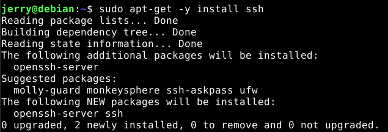
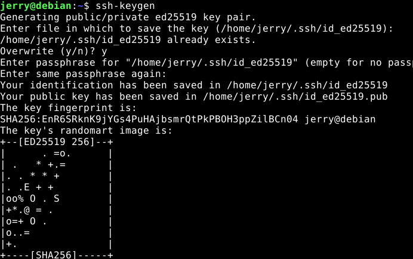
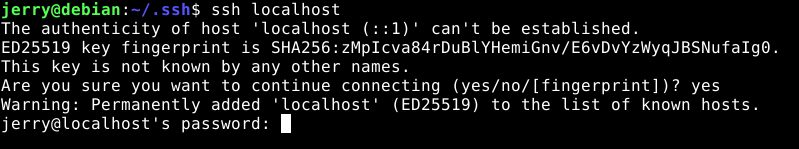
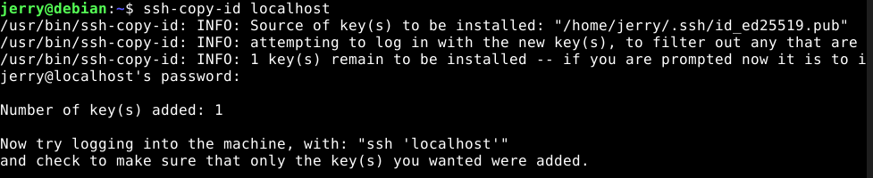
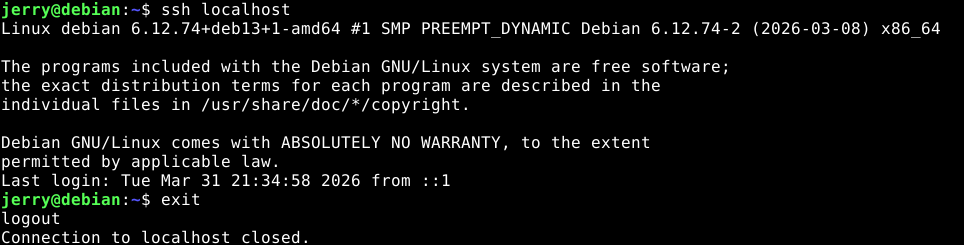
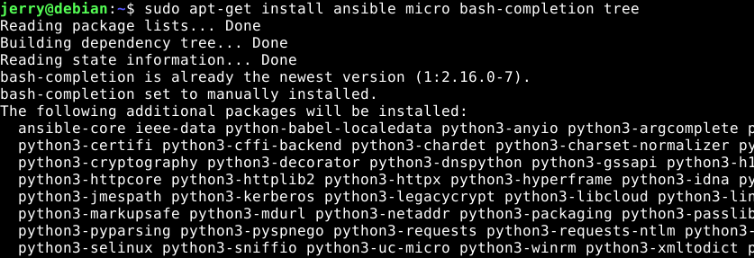
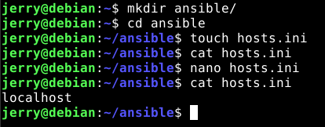
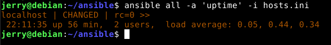
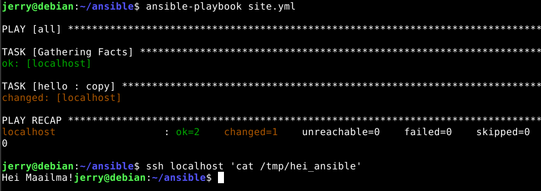
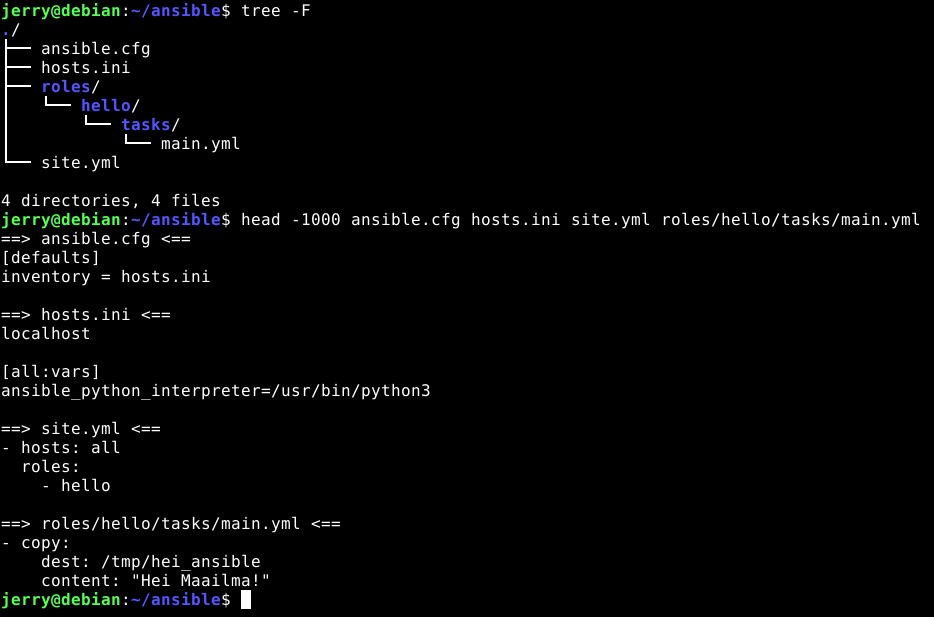

# Hei Ansiblen maailma

## Tiivistelmät

### SSH public key

- Kirjautumisen automatisointi toimii niin, että ensin päivitetään järjestelmä ja sitten asennetaan open-ssh-server
- SSH-serveri laitetaan päälle komennolla "sudo systemctl enable --now ssh"
- Seuraavaksi testataan toimiiko serveri ottamalla yhteyttä localhostiin SSH:n avulla
- Lopuksi generoidaan avainpari ja kopioidaan se localhostiin, jotta kirjautuminen automatisoituu

### Hello Ansible

- Ansible on työkalu, jolla voi tehokkaasti konfiguroida suurta määrää tietokoneita samanaikaisesti
- Ansible toimii niin, että luodaan erilaisia ryhmiä, joihin lisätään tiettyjä tietokoneita
- Ryhmiin voi sitten ajaa erilaisia komentoja, jotka tekevät muokkauksia koneisiin SSH-yhteyden avulla

## Tehtävä

### a)

- Ensimmäisenä asennetaan **SSH-demoni**



- Generoidaan SSH-avain komennolla `ssh-keygen`



- Varmistetaan, että SSH-demoni toimii ottamalla SSH-yhteys localhostiin komennolla `ssh localhost`

### b)



- Seuraavaksi automatisoidaan SSH-yhteys localhostiin kopioimalla julkinen SSH-avain
	- Localhostin, eli minun oman koneen SSH-avaimen kopioidaan komennolla `ssh-copy-id localhost`



- Nyt SSH kirjautuminen pitäisi onnistua ilman salasanaa



### c)

- Seuraavaksi valmistaudutaan tekemään Ansiblella "Hei Maailma"-testi asentamalla Ansible ja tarvittavat hyödylliset ohjelmat
	- `ansible`, `micro`, `bash-completion` ja `tree`



- Luodaan Ansiblen tarvittava hakemistorakenne ja tiedosto `hosts.ini`
	- `hosts-ini`-tiedoston sisälle lisätään kaikki konfiguroitavat koneet
		- Tässä tapauksessa pelkästään **localhost**



- Testataan, että Ansible toimii ajamalla jokaisella koneella (eli vain localhost) komento `uptime`
	- Tämä tehdään Ansiblella ajamalla komento `ansible all -a 'uptime' -i hosts.ini`, ansible-hakemiston sisällä



- Luodaan ansible-kansion sisälle hakemisto **roles**, jossa sijaitsee kaikki roolit
- Luodaan roles-hakemiston sisälle rooli **hello**, jonka avulla teemme "Hei Maailma"- testin
- hello-roolin sisälle tulee hakemisto **tasks** ja sen sisälle tiedosto **main.yml**
	- Täällä sijaitsee kaikki roolikohtaiset konfiguraatiot
- main.yml-tiedoston sisälle kirjoitetaan koodia, joka käskee Ansiblea luomaan tiedoston **/tmp/hei_ansible** kaikille koneille ja kirjoittaa tiedoston sisälle "Hei Maailma!"

```bash
cat roles/hello/tasks/main.yml
```
```YAML
- copy:
    dest: /tmp/hei_ansible
    content: "Hei Maailma!"
```

- Luodaan tiedosto **site.yml** ansible-hakemistoon
	- Tässä tiedostossa määritellään koneet joihin halutaan muutosten tulevan voimaan, sekä roolit joista Ansible saa tehtävät
- Lisätään tiedostoon site.yml hello-rooli
- Tämän jälkeen ajetaan komento `ansible-playbook site.yml` ansible-hakemiston sisällä ja varmistetaan, että muutokset menevät läpi



- Lopputuloksena meillä on toimiva Ansible ympäristö ja oikea hakemistorakenne jatkoa varten



## Lähteet
- Tero Karvinen SSH public key - Login without password. Luettavissa: https://terokarvinen.com/ssh-public-key-login-without-password/ Luettu 31.3.2026
- Tero Karvinen Hello Ansible. Luettavissa: https://terokarvinen.com/hello-ansible/ Luettu 31.3.2026
