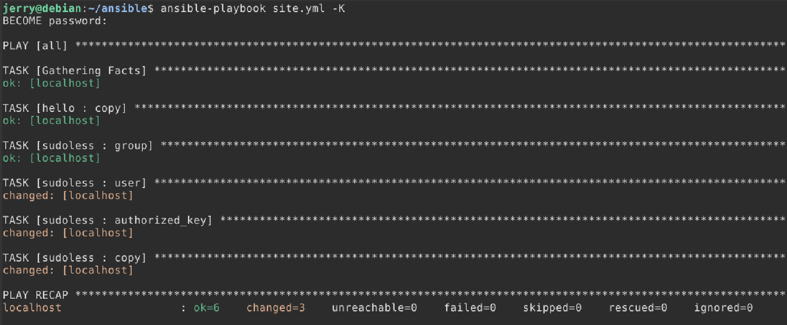
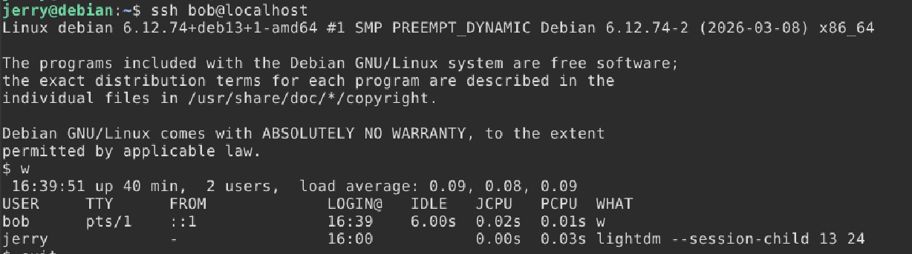
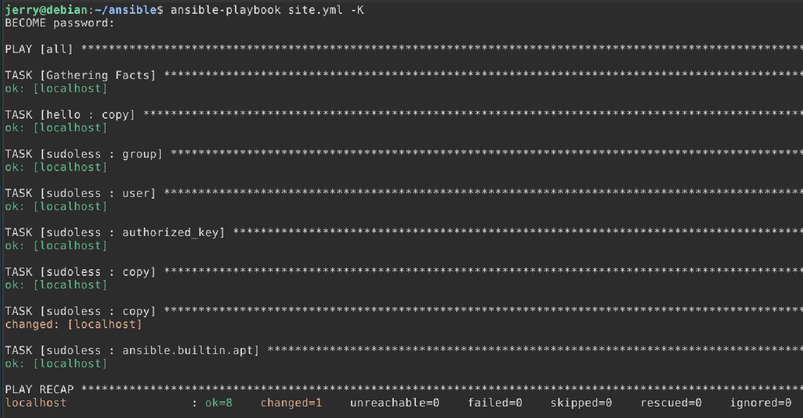
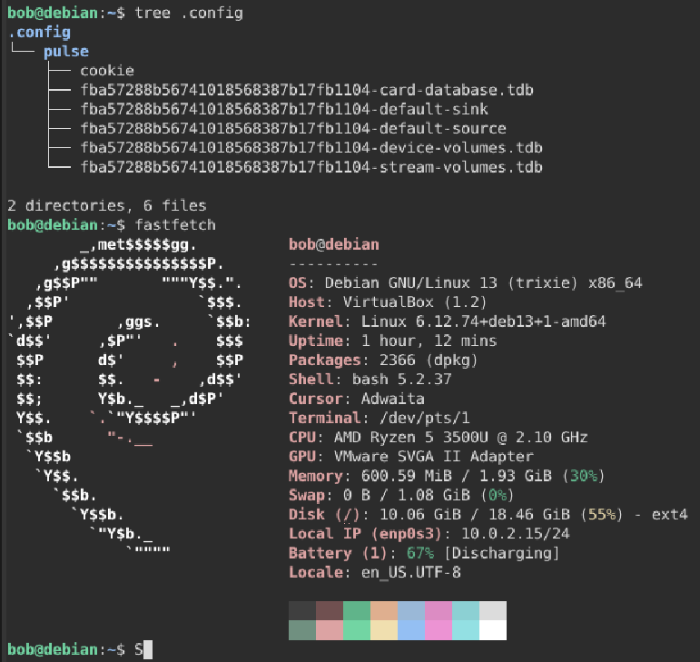
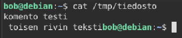
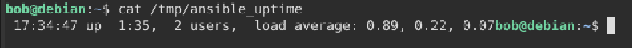

# H2 - Voileipä

## Tiivistelmät

### Sudo without password

- Luodakseen käyttäjän, joka voi käyttää **Sudoa** ilman salasanaa on ensin luotava käyttäjä ja lisättävä se ryhmään. Luodaan käyttäjä **jerry** ja lisätään se ryhmään **sudoless**.
- Jos vahingossa rikomme Sudon voimme lukita itsemme korjaamasta sitä, joten avaamme uuden **termiinaali-ikkunan**, jossa on auki **root shell** komennolla "**sudo -i**". Sen avulla voimme virhetilanteessa päästä vielä korjaamaan järjestelmän.
- Tämän jälkeen voimme tehdä **sudoers** säännön sudoless ryhmälle, joka mahdollistaa Sudon käytön ilman salasanaa.
- Sitten voimme testata toimiiko tämä kirjautumalla käyttäjälle ja ajamalla "**sudo echo testi**" komennon.

### xkcd 149: Sandwich


- Sarjakuva kertoo, että sudo komento on kuin taikasana, jolla saa järjestelmän tekemään, mitä haluaa

### Passwordless Sudo with Ansible

- Saadakseen salasanattoman Sudon toimimaan pitää ensin saada **Ansible** toimimaan ja oikea hakemistorakenne pystyyn.
- Kun Ansible toimii voimme luoda roolin, joka ensin luo uuden käyttäjän sudoless ryhmään ja lisää **sudoers.d/NOPASSWD** säännön ryhmälle
- Lopuksi testataan Ansiblea sudo oikeuksilla. Lisätään "become: true" site.yml-tiedostoon ja testataan "ansible-playbook" komentoa

### ansible-doc

- ansible-doc copy
  - kopioi tiedoston koneelta toiselle. Moduulin avulla voidaan myös määritellä tiedoston esimerkiksi omistaja ja oikeudet
  - optiot:
      - content: määrittää tiedoston sisällön
      - dest: määrittää tiedoston sijainnin, minne se luodaan
      - src: tiedston paikallinen sijainti, joka kopioidaan toiselle koneelle
      - owner: määrittää tiedoston omistajan
      - group: määrittää tiedoston omistavan ryhmän
      - mode: määrittää tiedoston oikeudet
- ansible-doc apt
  - hallinnoi apt paketteja
    - optiot:
      - name: lista pakettien nimiä, joita asentaa
      - state: määrittää asennettavan paketin halutun version
      - update_cache: ajaa komennon "apt-get update" ennen paketin asentamista
- ansible-doc file
  - asettaa tiedostojen tai hakemistojen ominausuuksia tai luo symbolisia linkkejä
    - optiot:
      - path: muokattavan tiedoston sijainti
      - recurse: lisää rekursiivisesti muokkaukset hakemiston sisällölle
      - src: tiedoston sijainti, johon tehdä symbolinen linkki
      - state: tarkistaa onko tiedosto tai hakemisto olemassa ja luo tai poistaa ne tuloksen perusteella
      - owner: määrittää omistajan
      - group: määrittää omistavan ryhmän
      - mode: määrittää oikeudet
- ansible-doc user
  - hallinnoi käyttäjiä ja käyttäjien ominaisuuksia
    - optiot:
      - name: käyttäjän nimi, joka luodaan, poistetaan tai muokataan
      - create_home: jos "true", luodaan käyttäjälle oma kotihakemisto
      - comment: luo käyttäjälle kuvauksen
      - groups: määrittää ryhmät, joihin käyttäjä lisätään
      - shell: määrittää käyttäjän shellin
      - state: määrittää onko käyttäjä olemassa
      - system: jos käyttäjän state: present, niin tekee käyttäjästä järjestelmän käyttäjän
- ansible-doc authorized_key
  - lisää tai poistaa käyttäjältä SSH avaimia
    - optiot:
      - user: määrittää käyttäjän nimen, jolla lisätä avain
      - key: määrittää SSH avaimen

## Tehtävä

### a)

- Ensin luodaan käyttäjä **jerry**, luodaan ryhmä **sudoless** ja lisätään käyttäjä ryhmään

```console
$ sudo adduser jerry
$ sudo groupadd sudoless
$ sudo adduser jerry sudoless
```

- Avataan erillisessä terminaali-ikkunassa **root shell** sitä varten jos asiat menevät rikki ja täytyy tehdä korjauksia

```console
$ sudo -i
```

- Lisätään **sudoers** sääntö, joka antaa sudoless-ryhmälle oikeudet käyttää sudoa ilman salasanaa

```console
$ sudo visudo /etc/sudoers.d/sudoless

%sudoless ALL = (ALL) NOPASSWD: ALL
```

- Testataan käyttäjällä jerry sudo-komentoa

```console
$ ssh jerry@localhost
$ sudo -k
$ sudo echo "testi moi"
testi moi
```

### b)

- Ensin varmistetaan, että on olemassa toimiva Ansible järjestelmä ja hakemistorakenne

```console
$ tree -F
./
├── ansible.cfg
├── hosts.ini
├── roles/
│   ├── hello/
│   │   └── tasks/
│   │       └── main.yml
│   └── sudoless/
│       └── tasks/
│           └── main.yml
└── site.yml
```

- Lisätään rooliin sudoless komennot, jotka luovat uuden käyttäjän, lisäävät käyttäjän sudoless-ryhmään ja antaa oikeudet käyttää sudoa ilman salasanaa

```console
$ cat roles/sudoless/tasks/main.yml
```

```YAML
- group:
    name: "sudoless"
    state: present
- user:
    name: "bob"
    state: present
    groups: ["sudoless", "sudo", "adm"]
- authorized_key:
    user: "bob"
    key: "ssh-ed25519 AAAAC3NzaC11LZDI1NTE5AAAAIAqouuebfgJ6mvCjnIQzuYQgNU6FSnYAS3SWTyFWAv/N jerry@debian"
- copy:
    dest: "/etc/sudoers.d/sudoless"
    content: "%sudoless ALL = (ALL) NOPASSWD: ALL\n"
    owner: "root"
    group: "root"
    mode: "0644"
```

- Lisätään site.yml tiedostoon rivi "become: true" ja sudoless-ryhmä

```YAML
- hosts: all
  become: true
  roles:
    - hello
    - sudoless
```

- Ajetaan ansible-playbook ja kysytään sudo salasana

```console
$ ansible-playbook site.yml -K
```




### c)

- Lisätään sudoless-ryhmän main.yml tiedostoon moduuli **ansible.builtin.apt** ja asennetaan paketit **tree** ja **fastfetch**

```YAML
- ansible.builtin.apt
    pkg:
    - tree
    - fastfetch
    state: latest
    update_cache: yes
```

- Optio "state latest" varmistaa, että paketeista asennetaan uusin versio ja optio "update_cache: yes" ajaa "apt-get update" ennen pakettien asentamista
- Ajetaan "ansible-playbook" ja varmistetaan, että muutokset meni läpi



- Tarkistetaan käyttäjällä bob, että paketit ovat asennettu



### d)

- Lisätään jälleen sudoless-ryhmän main.yml tiedostoon copy-moduuli ja luodaan tiedosto **/tmp** hakemistoon ja erotellaan rivin käyttämällä "\n"

```YAML
- copy
    dest: "/tmp/tiedosto"
    content: "komento testi\n toisen rivin teksti"
    owner: "bob"
    group: "sudoless"
    mode: "0644"
```

- Tiedoston oikeudet ovat "0644", eli symbolisessa muodossa **-rw-r--r--**
  - Tämä tarkoittaa, että tiedoston omistajalla on oikeus lukea ja muokata tiedostoa ja ryhmällä sudoless ja muilla käyttäjillä on vain oikeus lukea
- Ajetaan "ansible-playbook" ja tarkistetaan käyttäjän bob /tmp hakemistosta onko tiedosto luotu oikein



### e)

- Päätin tehdä käskyn sudoless-ryhmälle, joka ajaa orjakoneilla komennon "uptime", tallentaa sen muuttujaan "ansible_uptime" ja tämän jälkeen kopioi komennon tuloksen tiedostoon "/tmp/ansible_uptime" orjakoneilla

```YAML
- name: Check Uptime
  command: uptime
  register: ansible_uptime
- name: Put Uptime into file
  copy:
    content: "{{ ansible_uptime.stdout }}"
    dest: /tmp/ansible_uptime
```



## Lähteet
- Tero Karvinen Sudo without password. Luettavissa: https://terokarvinen.com/passwordless-sudo/ Luettu 7.4.2026
- Munroe Sandwich. Luettavissa: https://xkcd.com/149/ Luettu 7.4.2026
- Tero Karvinen Passwordless Sudo with Ansible. Luettavissa: https://terokarvinen.com/passwordless-sudo-with-ansible/ Luettu: 7.4.2026
- Harsh Mishra Ansible Tasks: Complete guide for Beginners. Luettavissa: https://dev.to/harshm03/ansible-tasks-complete-guide-for-beginners-2gn3 Luettu: 7.4.2026
