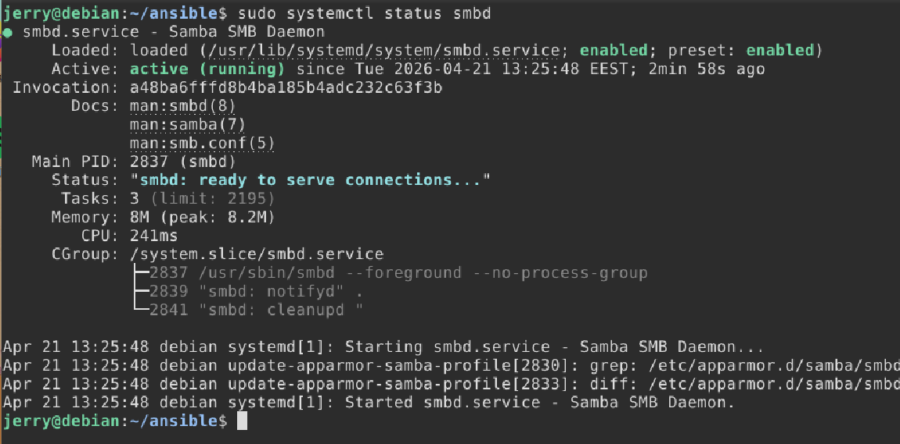
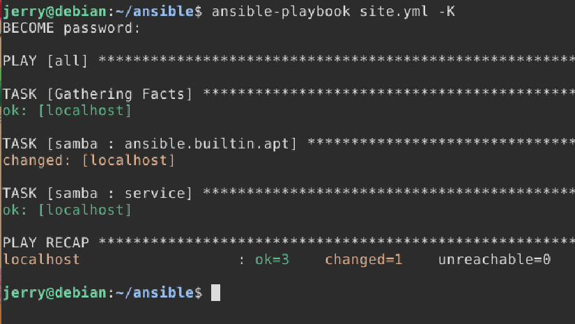
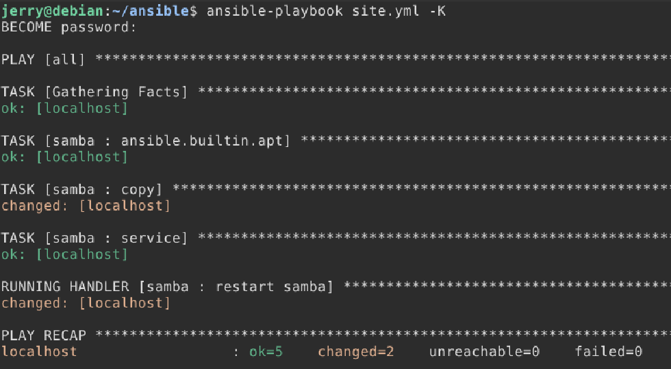
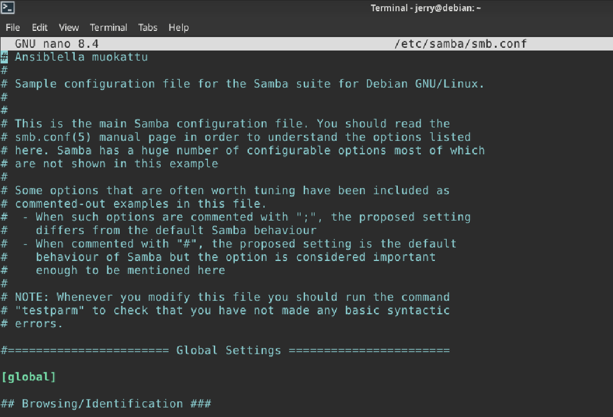
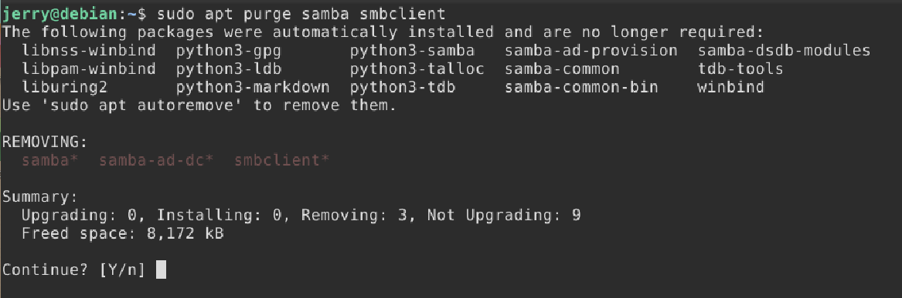
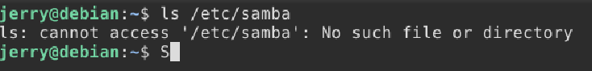
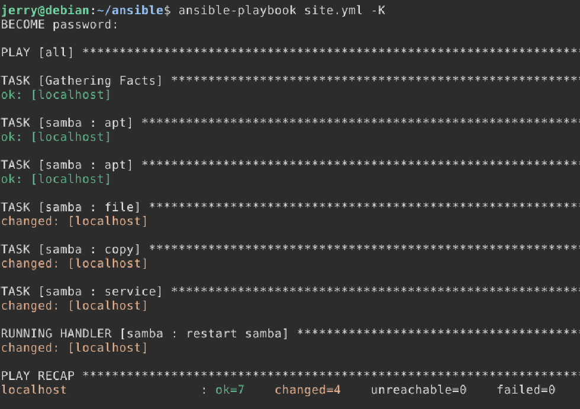
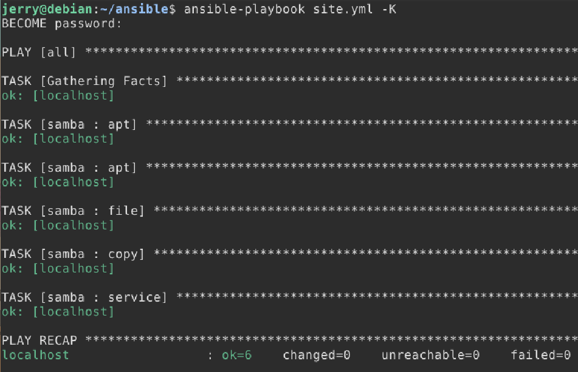

# H4 - Pizza Fantasia

## Tiivistelmät

### Size and Complexity of Some DSLs

-   DSL:issä voi olla **kymmeniä tai satoja ominaisuuksia**
-   Suuri ominaisuusmäärä lisää monimutkaisuutta
-   Kaikkia ominaisuuksia ei käytetä käytännössä
-   DSL:t laajenevat ajan myötä (**feature creep**)

## Use of DSL Functions in Case Configuration

-   Käytännön konfiguraatioissa käytetään vain pientä osaa
    ominaisuuksista
-   Yleisimpiä:
    -   perusresurssien määrittely
    -   yksinkertaiset ehdot
    -   riippuvuuksien hallinta
-   Monimutkaiset funktiot harvinaisia
-   Käyttö usein **toistuvaa ja standardoitua**

## 4.12.3.1 Dependencies Between Main Functions

-   Riippuvuudet ovat keskeinen osa konfiguraatiota
-   Tärkeimmät elementit:
    -   resurssien määrittely
    -   halutun tilan varmistus (desired state)
    -   riippuvuuksien määrittely (esim. order, requires)
-   Riippuvuudet ohjaavat **suoritusjärjestystä**
-   Riippuvuudet voivat muodostaa **monimutkaisia verkkoja**
-   Hyvin määritellyt riippuvuudet lisää luotettavuutta

## Tehtävä

### a)

- Valitsin asennettavaksi demoniksi **Samban**, koska se on minulle entuudesta tuttu omalla kotiserverilläni

- Ensin asennetaan tarvittavat paketit, eli **samba** ja **smbclient** ja laitetaan **smb demoni** päälle

```bash
$ sudo apt update
$ sudo apt install samba smbclient

$ sudo systemctl start smbd
```



### b)

- Ensin luodaan ansiblee rooli nimeltä **samba**

```bash
$ tree -F roles/samba

roles/samba/
└── tasks/
    └── main.yml
```

- muokataan tiedostoa **main.yml**, että oikeat paketit asentuvat automaattisesti

```YAML
- apt:
    name: samba
    state: present

- apt:
    name: samba
    state:present

- service:
    name: smbd
    state: started
    enabled: yes
```

- Ensin poistetaan Samba-paketit ja ajetaan ansible-playbook tarkistaakseen toimiiko asennus

 ```bash
$ sudo apt purge samba smbclient
$ ansible-playbook site.yml -K
```



- Asennus toimi ja Samba-demoni meni päälle

### c)

- Lisätään ansiblen samba rooliin konfiguraatiota Samban tiedostoon **/etc/samba/smb.conf**
- Luodaan **handlers** ja **files** hakemistot
  - handlers hakemiston avulla saadaan samba käynnistymään uudelleen muokkausten jälkeen ja files hakemistoon laitamme muokatun version smb.conf tiedostosta
  - files/smb.conf tiedosto on kopioitu suoraan tiedostosta /etc/samba/smb.conf

```bash
$ tree -F roles/samba

roles/samba/
└── files/
    └── smb.conf
└── handlers/
    └── main.yml
└── tasks/
    └── main.yml
```

```bash
$ cat handlers/main.yml

- systemd:
    name: smbd
    state: restarted
```

- Muokataan tiedostoa files/smb.conf lisäämällä kommentti "Ansiblella muokattu" tiedoston yläosaan
- Sitten lisätään kaikki toiminnat tasks/main.yml tiedostoon

```YAML
- apt:
    name: samba
    state: present

- apt:
    name: samba
    state:present

- files:
    path: /etc/samba
    state: directory
    mode: '0755'
become: true

- copy:
    dest: "/etc/samba/smb.conf"
    src: "smb.conf"
    owner: "root"
    group: "root"
    mode: '0644'
  notify: restart samba

- service:
    name: smbd
    state: started
    enabled: yes
```

- Nyt samba-rooli varmistaa että molemmat tarvittavat paketit asentuvat, /etc/samba hakemisto on olemassa ja lisää muokatun smb.conf tiedoston oikeaan paikkaan
- Ajetaan ansible-playbook ja tarkistetaan tilanne





- Paketit asentuivat, muokkaus tuli näkyviin oikeaan paikkaan ja samba uudelleenkäynnistyi

### d)

- Rikotaan Samba poistamalla tarvittavat paketit sekä konfiguraatiotiedostot

```bash
$ sudo apt purge samba smbclient
$ sudo rm -r /etc/samba
```




- Ajetaan ansible-playbook ja varmistetaan, että tilanne korjaantuu



- Paketit asentuvat uudelleen, /etc/samba hakemisto luodaan ja muokkaukset edelleen tulevat näkyviin

### c)

- Ajetaan ansible-playbook vielä kerran, että tiedämme tilan olevan idempotentti



## Lähteet
- Tero Karvinen 2023 Configuration Management of Distributed Systems over Unreliable and Hostile Networks. Luettavissa: [Configuration Management of Distributed Systems over Unreliable and Hostile Networks](https://westminsterresearch.westminster.ac.uk/item/w7vvz/configuration-management-of-distributed-systems-over-unreliable-and-hostile-networks) Luettu 21.4.2026
