# H5 - Gitar Hero

## Tiivistelmät

### Pro Git, 2ed: 1.3 Getting Started - What is Git?

- Git tallentaa **snapshoteja** koko projektin tilasta, ei yksittäisten tiedostojen muutoksia kuten muut versionhallintajärjestelmät
- Lähes kaikki toimii paikallisesti
  - koko historia on omalla koneella
- Kaikki tallennettu tieto tarkistetaan **SHA-1-tiivisteellä**, joten mikään muutos ei jää huomaamatta
- Git-operaatiot lähinnä lisäävät dataa
- Tiedostoilla on kolme tilaa: `modified`, `staged`, `committed`

### git add --all && git commit

- `git add --all` – lisää kaikki muuttuneet, uudet ja poistetut tiedostot staging-alueelle
- `&&` – suorita seuraava komento vain jos edellinen onnistui
- `git commit` – luo uuden commitin staging-alueen sisällöstä, avaa editorin viestiä varten

### git pull && git push

- `;` – suorita seuraava komento joka tapauksessa (vaikka commit epäonnistuisi)
- `git pull` – hae muutokset etärepositoriosta ja yhdistä ne paikalliseen haaraan
- `&&` – suorita seuraava komento vain jos edellinen onnistui
- `git push` – lähetä paikalliset commitit etärepositorioon

## Tehtävä

### a)

- Luodaan Githubiin varasto nimeltä **sunshine-h5**, lisätään **README.md** tiedosto ja valitaan varaston lisenssiksi **GNU General Public License 3**

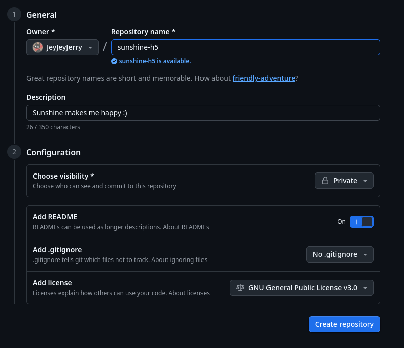
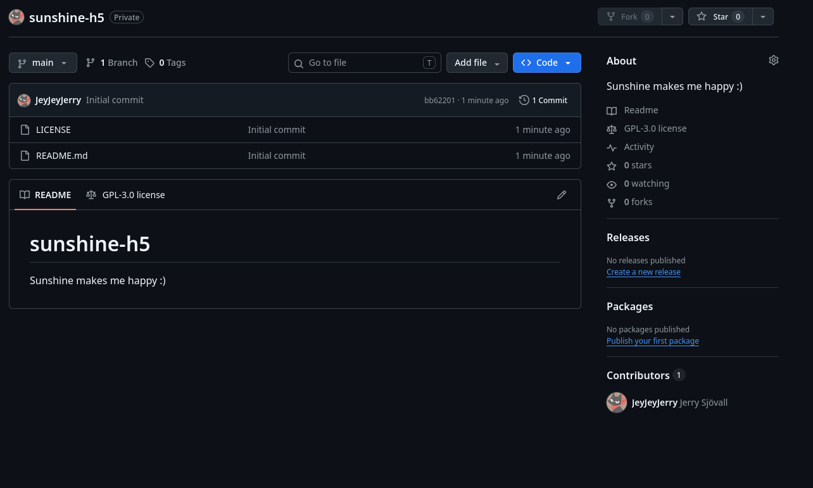

### b)

- Kloonataan varasto **sunshine-h5** virtuaalikoneelle komennolla `git clone` ja varaston SSH URL-osoitteella

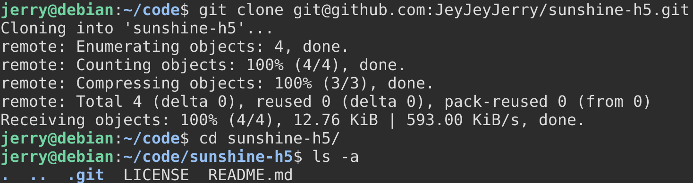

- Muokataan tiedostoa **README.md** ja pusketaan ne palvelimelle

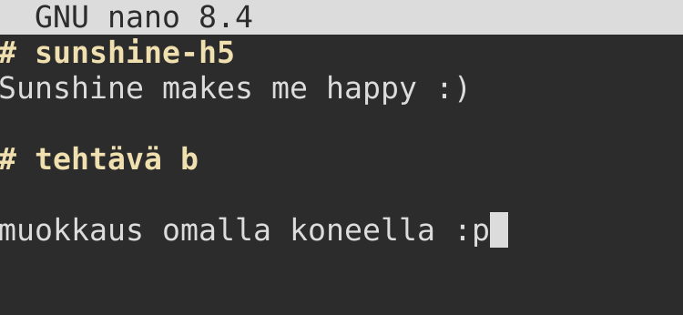
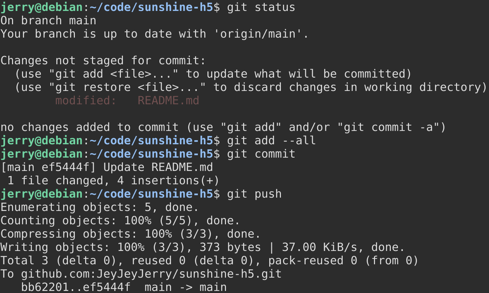

- Tarkistetaan, että muutokset tulivat näkyviin weppiliittymään

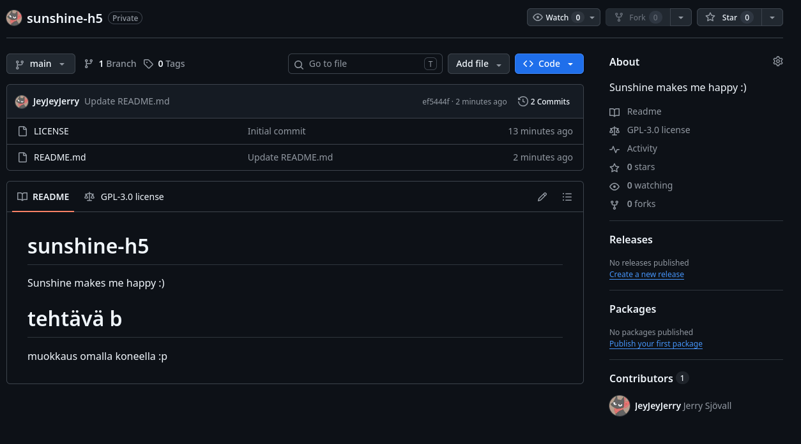

### c)

- Luodaan virtuaalikoneella varastoon **tyhmä-tiedosto** ja lisätään sen sisälle hieman tekstiä

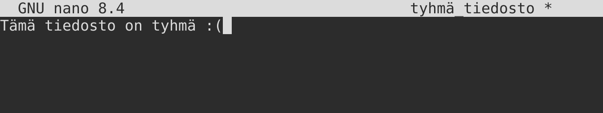

- Lisätään muutokset komennolla `git add --all`, mutta ei tehdä commit:tia vaan tuhotaan tyhmä muutos komennolla `git reset --hard`

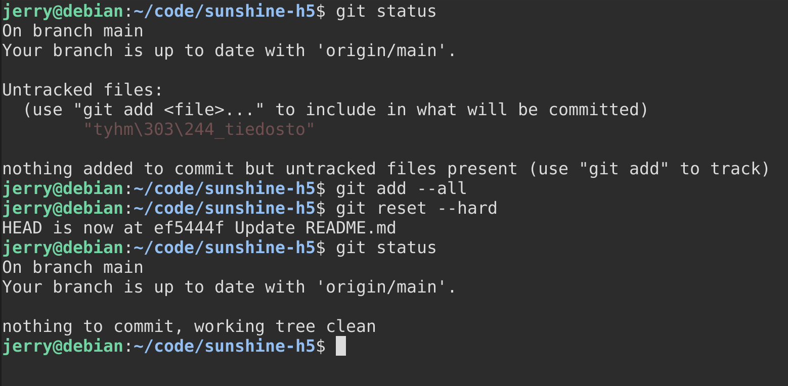

- Ajamalla komennon `git status` näämme, että muutokset ovat poistuneet ja varaston tila on siirtynyt siihen, missä se oli edellisen commitin jälkeen

### d)

- Tarkastellaan varaston **lokia** komennolla `git log -p`
  - `-p` on lyhenne optiosta `--patch`

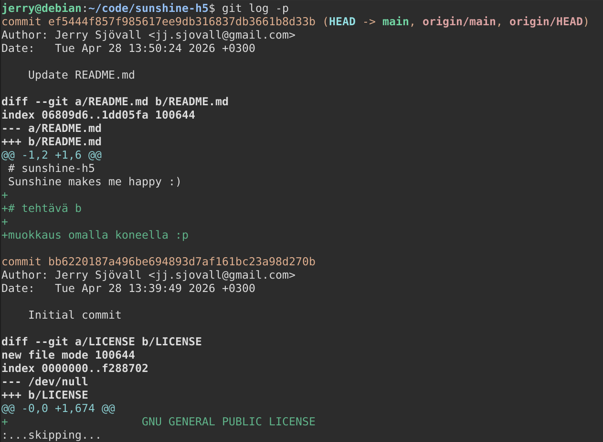

- Lokissa näkyy ensin alkuperäinen committi **(Initial commit)**, jossa luotiin **README.md** tiedosto ja lisättiin lisenssi
- Seuraavana lokissa näkyy muokkaus **README.md** tiedostoon
  - Loki näyttää `+` merkillä kaikki lisätyt uudet rivit ja niiden perässä muokatut tekstit
- Molemmissa commiteissa näkyy myös viesti, joka kertoo commitin sisällön ja tarkoituksen
- Myös nimeni ja sähköpostiosoitteeni näkyy haluamallani tavalla

### e)

- Tehdään kansiosta `~/ansible/roles` git-varasto komennolla `git init`

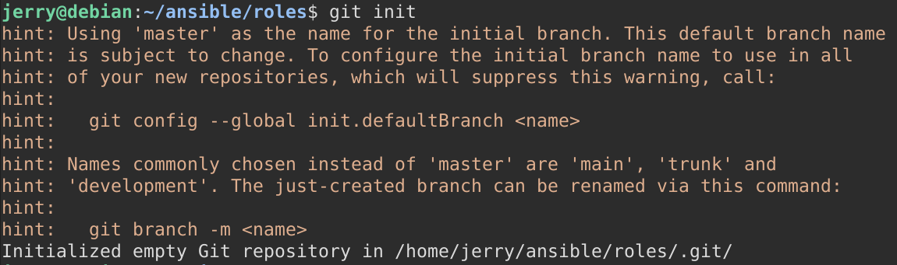

- Tehdään ensimmäinen commit **(Initial commit)** heti varaston luomisen jälkeen, koska varasto ei toimi jos se on tyhjä

```bash
$ git add --all
$ git commit
```

- Tiedosto `hello/tasks/main.yml` tekee tiedoston hakemistoon `/tmp/hei_ansible`, jossa lukee "Hei Maailma". Muokataan se sanomaan "Hei Git"

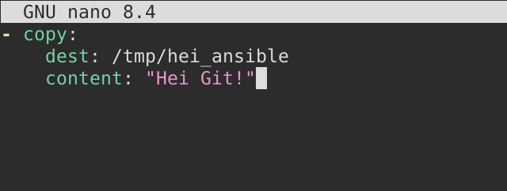

- Ajetaan ensin komento `ansible-playbook site.yml -K` ja varmistetaan, että muutokset menevät läpi

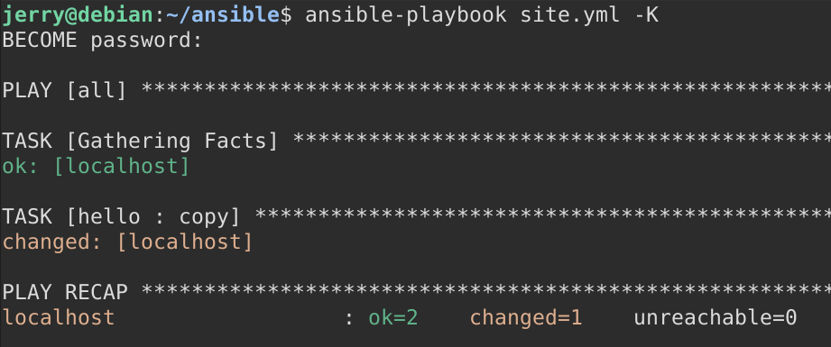

- Kun muutokset ovat menneet läpi, tehdään niistä myös commit

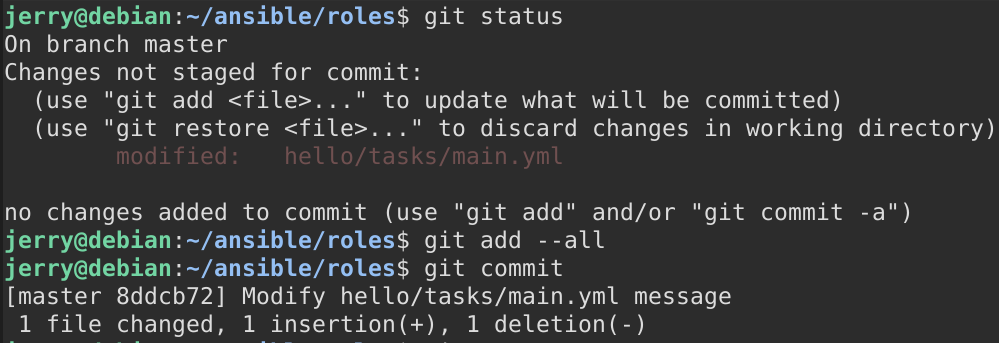

### f)

- Pari hankittu projektia varten :)

## Lähteet

- Chacon and Straub 2014: Pro Git, 2ed: 1.3 Getting Started - What is Git?. Luettavissa: [Pro Git, 2ed: 1.3 Getting Started - What is Git?](https://git-scm.com/book/en/v2/Getting-Started-What-is-Git%3F) Luettu 28.4.2026
- Git-scm 2026: Git-log - Documentation. Luettavissa: [Git-log - Documentation](https://git-scm.com/docs/git-log) Luettu 28.4.2026
- Git-scm 2026: Git-add - Documentation. Luettavissa [Git-add - Documentation](https://git-scm.com/docs/git-add) Luettu 28.4.2026
- Git-scm 2026: Git-commit - Documentation. Luettavissa [Git-commit - Documentation](https://git-scm.com/docs/git-commit) Luettu 28.4.2026
- Git-scm 2026: Git-push - Documentation. Luettavissa [Git-push - Documentation](https://git-scm.com/docs/git-push) Luettu 28.4.2026
- Git-scm 2026: Git-pull - Documentation. Luettavissa [Git-pull - Documentation](https://git-scm.com/docs/git-pull) Luettu 28.4.2026


